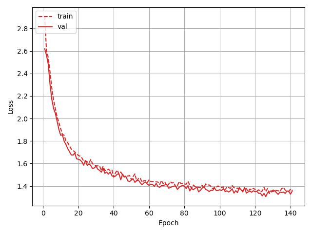

# PicoGPT
This project implements a no-fuss GPT model that avoids fancy multi-GPU training strategies. The GPT contains 6.34 million parameters (very similar to MobileNets) and trained in an old hardware having Intel-i3 processor with 8 Gigs of ram. The model implementation is inherited from karapathy's famous [nanoGPT](https://github.com/karpathy/nanoGPT) implementation with some of my own basic modifications.

The model is trained on ~20 Gigs [Wikipedia dataset](https://huggingface.co/datasets/wikipedia) from Huggingface. The model is built and trained for educational purposes.

<p align="center">
  
</p>

## Directory Structure
```
PicoGPT
│
├── dataset
│   └── tinyshakespeare.txt      # contains tinyshakespere dataset for dummy training
├── inference.py                 # a seperate inference code to run the model
├── logs                         # contains train log
│   ├── log.jpg
│   └── log.pkl
├── model                        # contains main model
│   ├── dataloader.py            # two dataloaders: 1) tinyshakespere, 2) wikipedia
│   ├── model.py                 # the main GPT model
│   └── tokenizer.py             # a simple lowercase charachter tokenizer
├── LICENSE
├── README.md
└── train.py                     # model training code
```

## References:
* https://arxiv.org/abs/1706.03762
* https://github.com/karpathy/nanoGPT
* https://github.com/karpathy/ng-video-lecture/tree/master
