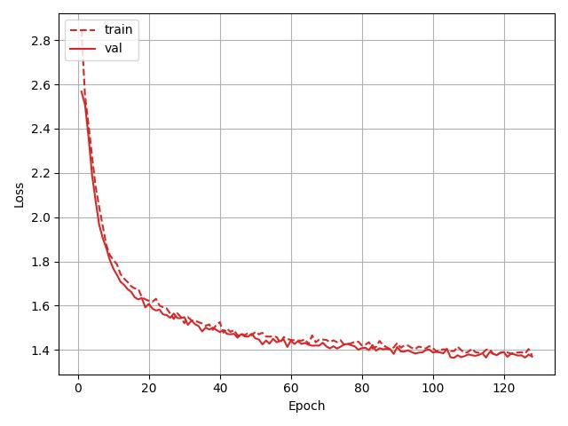

# PicoGPT
This project implements a no-fuss GPT model that avoids fancy multi-GPU training strategies. The GPT contains 6.34 million parameters (very similar to MobileNets) and trained in an old hardware having Intel-i3 processor with 8 Gigs of ram. The model implementation is inherited from karapathy's famous [nanoGPT](https://github.com/karpathy/nanoGPT) implementation with some of my own basic modifications.

The model is trained on ~20 Gigs [Wikipedia dataset](https://huggingface.co/datasets/wikipedia) from Huggingface. The model is built and trained for educational purposes.

<p align="center">
  
</p>

The default context window of the model is 128. A mean context vector generated by PicoGPT to increase it’s context length to 1280. GPT generates embeddings for token sequences. For a sequence of twice as large as current context length, a context vector can be generated by giving the first half as input to GPT. During the process of producing output, a mean of the token sequence embeddings is generated and used as a context vector for the next sequence. Below image gives an illustration of the approach.

## Model configuration:
```python
class GPTConfig:
    # Model parameters: 6.34M [Comparable with MobileNets]
    # Improves large-sequence word generation
    context_len: int = 128
    # Using charachter-level tokenization
    # Actual vocab-size is 75, saving some tokens for future use
    vocab_size: int = 88
    # Improves overall understanding of text
    n_layer: int = 8
    # Heads gives better understanding of word relation
    # Avoids common grammar-level mistakes
    n_head: int = 8
    # Incresing n_embd gave better word memorization
    n_embd: int = 256
    # Regularization
    # [0.0 for now as we want the model to overfit]
    dropout: float = 0.0
    bias: bool = True
```

## Directory Structure
```
PicoGPT
│
├── dataset
│   └── tinyshakespeare.txt      # contains tinyshakespere dataset for dummy training
├── inference.py                 # a seperate inference code to run the model
├── logs                         # contains train log
│   ├── log.jpg
│   └── log.pkl
├── model                        # contains main model
│   ├── dataloader.py            # two dataloaders: 1) tinyshakespere, 2) wikipedia
│   ├── model.py                 # the main GPT model
│   └── tokenizer.py             # a simple lowercase charachter tokenizer
├── LICENSE
├── README.md
└── train.py                     # model training code
```

## References:
* https://arxiv.org/abs/1706.03762
* https://github.com/karpathy/nanoGPT
* https://github.com/karpathy/ng-video-lecture/tree/master
